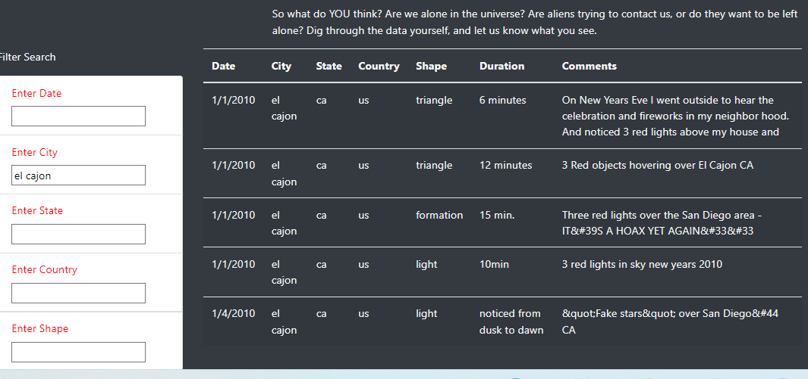
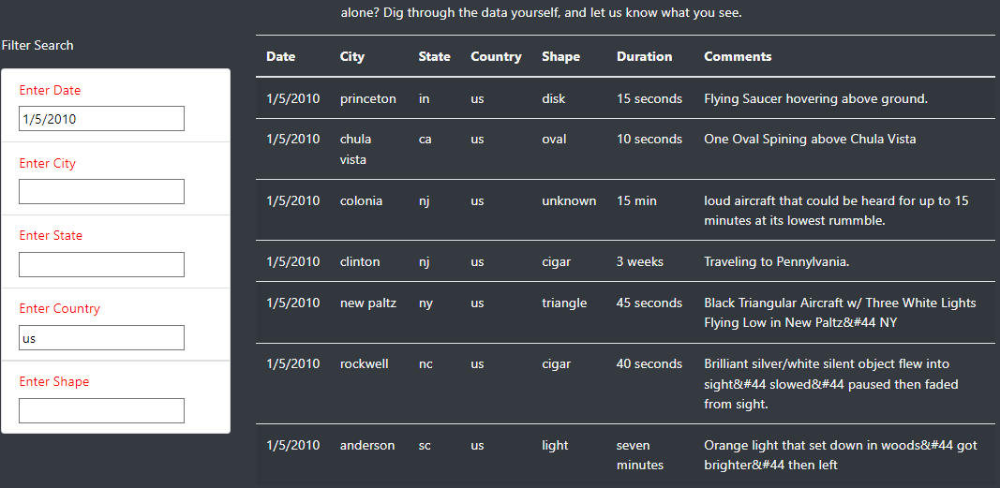
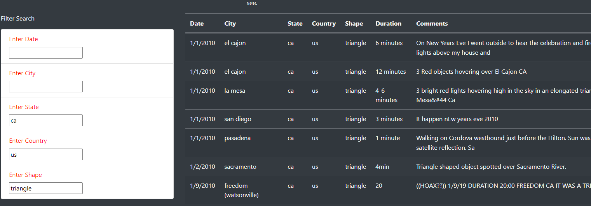
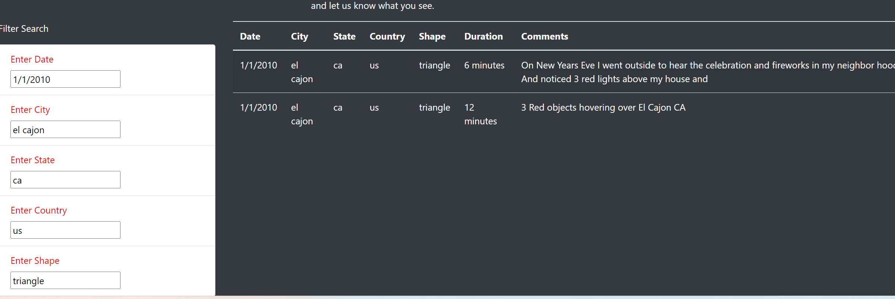

# UFOs

JavaScript, HTML, CSS, Bootstrap

## Overview:

The purpose of this excercise is to create an interactive webpage that will allow users to input multiple filters for the data about UFOs sightings. Then display the table according to the user's input search.

In this excercise, I'll build a table using data stored in a JavaScript array. I'll also create filters to make this table dynamic, meaning that it will take in the user's input, filter the data according to the user's input and then place the table into an HTML file for easy viewing.

## Challenge

Filter UFOs sightings on multiple criteria at the same.  The criteria are: city, state, country, and shape.

## Results:

   ### Examples: 
   
   1. Search using 1 criteria. User enter city: el cajon. 
    The table will display all UFOs sightings with the city matching user's input search.
    
     

  2. Search by using 2 criteria: User enter date: 1/5/2010, and country: us. 
    The table will only display UFOs sightings with matching input search date and country.
    
  
     
    

  3. Search by using 3 criteria.  User enter state: ca, country: us, and shape: triangle. 
    The table will only display UFOs sightings with matching input search date, country, and shape.
    
 
     
    
  4. Search by all criteria. User enter date: 1/1/2010, city: el cajon, state: ca , country: us, and shape: triangle.
   The table will only display UFOs sightings with matching input search date, city, state, country, and shape.
    
  
    
     

## Summary:

One drawback of this project is that it's using outdated data 2010. 

Two recommendations are:

   1. Ability to have access to the latest informations, 2022 data.
   2. A message inform the user when information of a request is not found, instead of a blank screen.
    
